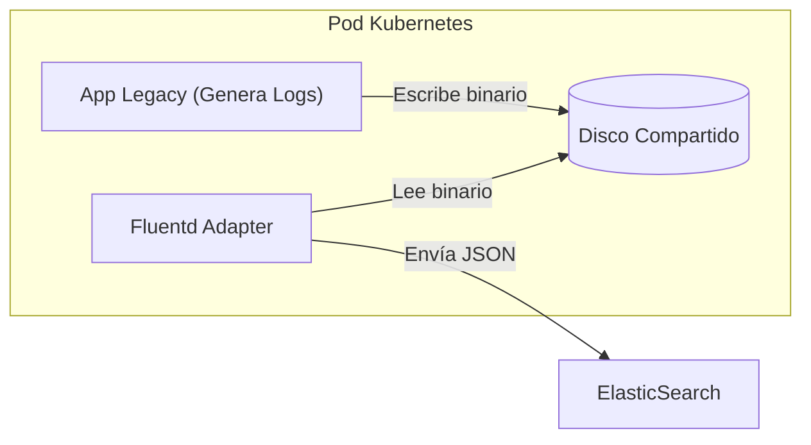

# Ejemplo Módulo 3. Simplificando el Acceso: Adapter, Facade y Proxy

### 🛠️ Estrategias de Implementación

:::: tabs

== 📱 DAM (Móvil - Kotlin)

**Contexto:**
Imagina que te obligan a usar una API antigua que devuelve XML, pero tu app moderna usa objetos Kotlin (Data Classes).
Creas un Adaptador que envuelve la API antigua. Tu app llama al adaptador pidiendo objetos, y el adaptador hace el trabajo sucio de parsear XML por detrás.

::: details Ver Implementación (Legacy XML)
```kotlin
// Interfaz Moderna (Lo que tu app quiere)
data class Clima(val ciudad: String, val grados: Int)

// Sistema Antiguo (Lo que te dan: XML feo)
class ApiAntigua {
    fun getXML() = "<clima><ciudad>Madrid</ciudad><temp>25</temp></clima>"
}

// EL ADAPTADOR
class ClimaAdapter(private val api: ApiAntigua) {
    fun getClima(): Clima {
        // 1. Llama al sistema viejo
        val xml = api.getXML()
        
        // 2. TRADUCE (Adaptación)
        // (Aquí iría lógica de parsing real)
        val ciudad = "Madrid" 
        val temp = 25
        
        // 3. Devuelve formato nuevo
        return Clima(ciudad, temp)
    }
}

// Uso: Tu app ni se entera de que existe el XML
val clima = ClimaAdapter(ApiAntigua()).getClima()
```
:::

== 🌐 DAW (Backend - PHP)

**Contexto:**
A menudo integras con bancos o servicios gubernamentales antiguos que piden XML, pero tú trabajas con JSON o Arrays de PHP.
El Adaptador recibe tus datos limpios y los convierte al formato arcano que pide el tercero.

::: details Ver Implementación (Array a XML)
```php
<?php
class BancoAdapter {
    private $bancoLegacy;
    
    public function enviarPago(array $datos): void {
        // 1. TRADUCE: Array moderno -> XML antiguo
        $xml = "<pago cantidad='{$datos['cantidad']}'moneda='EUR' />";
        
        // 2. ENVÍA
        $this->bancoLegacy->procesar($xml);
    }
}

// Tu código
$pagos->enviarPago(['cantidad' => 100]); 
// No ves XML por ningún lado.
?>
```
:::

== ⚙️ ASIR (Infraestructura - Sidecar)

**Contexto:**
El patrón **Sidecar** es un adaptador a nivel de contenedor.
Tienes una App Legacy que escribe logs en un formato binario incomprensible. Tu sistema de monitoreo moderno (Elasticsearch) quiere JSON.
Solución: Pones un contenedor "Sidecar" pegado a la App. La App escribe su binario, el Sidecar lo lee, lo traduce a JSON y lo envía.



::: details Ver Implementación (Pod con Sidecar)
```yaml
apiVersion: v1
kind: Pod
metadata:
  name: app-con-adaptador
spec:
  containers:
  # 1. APP INCOMPATIBLE
  - name: legacy-app
    image: mi-app-vieja
    volumeMounts:
    - name: logs
      mountPath: /var/log/app
      
  # 2. EL ADAPTADOR (Sidecar)
  - name: log-adapter
    image: fluentd # Herramienta de traducción de logs
    volumeMounts:
    - name: logs
      mountPath: /var/log/app
    # Fluentd lee el fichero raro y lo manda como JSON a la central
```
:::

::::

## 🏰 2. Facade (La Conserjería)

**Propósito:** Simplificar algo complejo. Ofrecer una interfaz sencilla ("Fachada") para un sistema complicado con muchas piezas móviles.

> [!TIP] Analogía: El Hotel de 5 Estrellas
> Quieres cenar, que te laven la ropa y pedir un taxi.
> Podrías llamar a la cocina, luego a lavandería, luego a taxis...
> Mejor llamas a **Recepción (Facade)**. Dices "Paquete Completo". El recepcionista se encarga de llamar a todos por ti.

### 🛠️ Estrategias de Implementación

:::: tabs

== 📱 DAM (Móvil - Consolidación)

**Contexto:**
A veces hacer una acción simple en Android requiere 3 pasos: obtener permisos, iniciar sensor, leer buffer.
Un Facade oculta todo eso en una sola función `iniciar()`.

::: details Ver Implementación (Camera Facade)
```kotlin
// Clases complejas del sistema
class MananejadorPermisos { ... }
class SensorHardware { ... }
class BufferImagen { ... }

// FACADE (Tu amigo sencillo)
class CamaraFacil {
    private val permisos = MananejadorPermisos()
    private val sensor = SensorHardware()
    
    fun tomarFoto() {
        // Coordina todo el lío interno
        if (permisos.check()) {
            sensor.open()
            sensor.capture()
            sensor.close()
        }
    }
}

// Uso
CamaraFacil().tomarFoto() // ¡Una línea!
```
:::

== 🌐 DAW (Backend - Servicios)

**Contexto:**
Realizar una compra implica: cobrar (Stripe), generar factura (PDF), enviar email (Mailgun) y reducir stock (DB).
El `CheckoutFacade` (a veces llamado Servicio de Dominio) expone un método `comprar()` y coordina todo.

::: details Ver Implementación (Checkout Facade)
```php
<?php
class CheckoutFacade {
    // NOTA: Esto NO es un Controlador. El controlador recibe la petición HTTP
    // y llama a este Facade. Esto es pura Lógica de Negocio.
    public function __construct(
        private Stripe $stripe,
        private PdfGenerator $pdf,
        private Mailer $mailer
    ) {}

    public function procesarPedido($usuario, $carrito) {
        // La complejidad está encapsulada aquí
        $pago = $this->stripe->cobrar($usuario->tarjeta, $carrito->total);
        $factura = $this->pdf->generar($carrito);
        $this->mailer->enviar($usuario->email, $factura);
        
        return true;
    }
}
?>
```
:::

== ⚙️ ASIR (Infraestructura - Ingress)

**Contexto:**
El **Ingress/Reverse Proxy** es la Fachada de tu centro de datos.
El mundo exterior ve **una sola IP** y un solo dominio (`api.empresa.com`).
Detrás de esa fachada hay cientos de servidores, bases de datos y redes internas que el usuario no ve.

::: details Ver Implementación (Nginx Facade)
```nginx
server {
    listen 80;
    server_name api.empresa.com;
    
    # LA FACHADA
    # El usuario pide /pagos, nosotros sabemos a dónde ir realmente.
    location /pagos {
        proxy_pass http://10.20.1.55:8080; # Servidor interno oculto
    }
    
    location /usuarios {
        proxy_pass http://10.20.1.56:3000; # Otro servidor distinto
    }
}
```
**Explicación:** Ocultamos la complejidad de nuestra red interna (IPs, puertos) detrás de una URL limpia.
:::

::::

