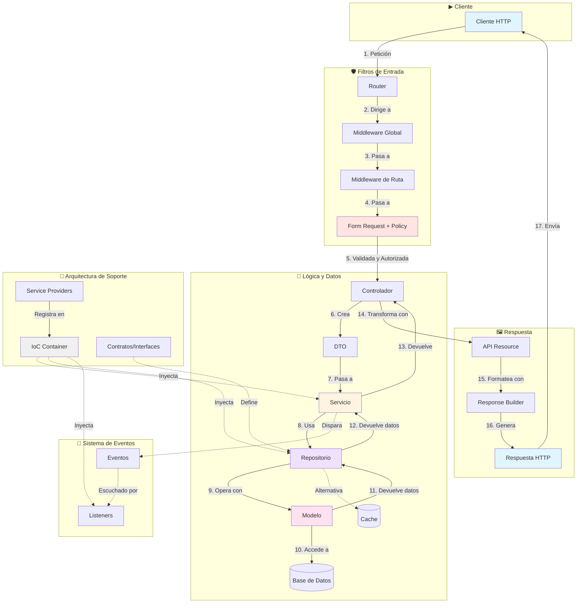
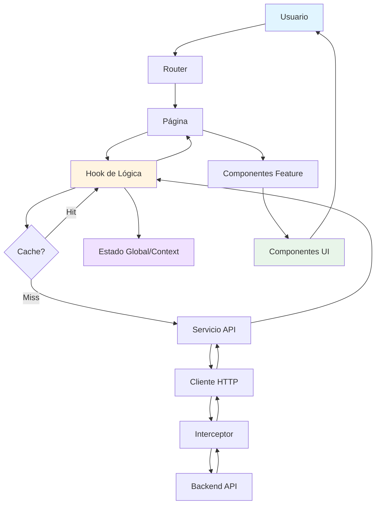

# 🎓 Ejemplo Guía Conceptual: Arquitectura Full Stack Profesional

## 🗺️ PARTE I: ARQUITECTURA BACKEND

Esta arquitectura se estructura en componentes lógicos y desacoplados. Cada componente tiene una única responsabilidad, comunicándose con otros componentes a través de contratos bien definidos.

### 🏗️ Estructura de Carpetas del Backend

* `/app`
  * `/Http`:
    * `/Controllers`: Controladores que coordinan el flujo de peticiones.
    * `/Middleware`: Filtros globales y de ruta.
    * `/Requests`: Clases de validación y autorización (Form Requests).
    * `/Resources`: Transformadores de modelos a JSON (API Resources).
  * `/Policies`: Clases de autorización para acciones sobre recursos.
  * `/Services`: Clases que contienen la lógica de negocio.
  * `/Repositories`: Interfaces e implementaciones para acceso a datos.
    * `/Contracts`: Interfaces de los repositorios.
    * `/Eloquent`: implementaciones concretas con Eloquent.
  * `/DTOs`: Objetos de transferencia de datos entre capas.
  * `/Events`: Eventos del sistema.
  * `/Listeners`: Clases que responden a eventos.
  * `/Exceptions`: Excepciones personalizadas del dominio.
  * `/Models`: Modelos de base de datos.
  * `/Providers`: Proveedores de servicios para inyección de dependencias y registro en el contenedor IoC.
* `/config`: Archivos de configuración de la aplicación.
* `/database`:
  * `/migrations`: Migraciones de base de datos.
  * `/seeders`: Datos de prueba.
* `/routes`: Definición de rutas de la API.
* `/tests`: Tests unitarios y de integración.
  * `/Unit`: Tests unitarios de servicios y repositorios.
  * `/Feature`: Tests de integración de controladores.

### 🌊 Flujo Arquitectónico del Backend (Diagrama Visual)

Para ilustrar el ciclo de vida de una petición, se usa este diagrama conceptual:

-----

## 🎨 PARTE II: ARQUITECTURA FRONTEND

### 🏗️ Estructura de Carpetas del Frontend

* `/src`
  * `/api`: Configuración del cliente HTTP y servicios de datos.
  * `/assets`: Recursos estáticos como imágenes, fuentes e iconos.
  * `/components`: Componentes de interfaz reutilizables.
    * `/ui`: Componentes básicos como botones, inputs o modales.
    * `/layout`: Componentes estructurales como cabecera, barra lateral o diseño principal.
  * `/features`: Carpeta principal de la arquitectura. Se organizan módulos independientes por cada funcionalidad de la aplicación.
    * `/[nombre-feature]`:
      * `/api`: Llamadas a la API específicas de esta funcionalidad.
      * `/components`: Componentes específicos de esta funcionalidad.
      * `/hooks`: Hooks personalizados con la lógica de negocio.
      * `/slices`: Estado global relacionado con esta funcionalidad (opcional).
      * `/types`: Definiciones de tipos de TypeScript.
      * `/__tests__`: Tests de esta funcionalidad.
  * `/hooks`: Hooks personalizados globales y reutilizables.
  * `/pages`: Componentes que representan las vistas principales de la aplicación. Se implementa carga diferida para optimizar rendimiento.
  * `/routes`: Configuración centralizada del enrutador. Se incluyen rutas protegidas para autenticación.
  * `/store`: Configuración del gestor de estado global cuando sea necesario.
  * `/contexts`: Proveedores de contexto para estados compartidos como tema o notificaciones.
  * `/lib`: Configuración de librerías externas como cliente HTTP o validación.
  * `/types`: Tipos y definiciones de TypeScript globales para el proyecto.
  * `/utils`: funciones de ayuda, constantes y validadores genéricos.
  * `/styles`: Estilos globales y configuración de temas.
  * `/locales`: Recursos para internacionalización.
  * `App.jsx`: Componente raíz de la aplicación.
  * `main.jsx`: Punto de entrada de la aplicación.

### 🌊 Flujo de Datos en Frontend (Diagrama Visual)

Para paralelizar con el backend, se muestra un flujo típico:

